

[⇒ Youtubeで見る場合はコチラ](https://www.youtube.com/watch?v=8kKx_ZNQ_ms)

やぁみんなー！

ようこそ私のベース講座へ！  
よく来てくれたねー！

ん？なになに？  
「大人になって、ベースを始めてみたい」  
だって？
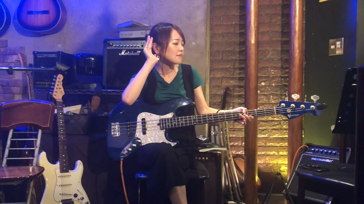

ハハハッ！  
キミキミ～！  
相当な音楽好きだねぇ。

それではさっそくベースという楽器について話していこう。

## ベースはギターとは全く違う楽器

まずベースというのは、  
この見た目から  
「ギターと同じなんじゃないの？」  
なんていうふうに思う人がいるんだけど、実は全然違う楽器なんだ。

まず見ていただきたいのは弦の数。

ギターは6弦なのに対して、  
**ベースというのは4本の弦で成り立っている**んだ。  
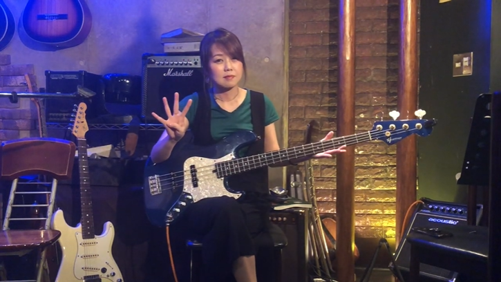

これがどういうことかというと、

ギターというのは6本の弦をじゃらんじゃらん鳴らすのに対して、  
**ベースというのは単音で一音ずつ鳴らしていく楽器**なんだね～。

## ベースではグルーヴ感が一番大事

それではさっそくベース講座に入っていこう。

・・・と、ここで、、

ベースで一番大切な事って、な～～んだ？？

うん。うん。うんうん！  
惜しい惜しい、うん。  
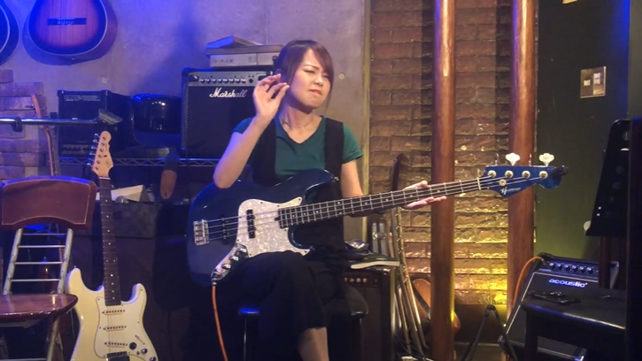

確かにそういう意見もあるかもしれない。

ただ、ここORB（オーブ）ではベースの真髄を、**グルーヴ感**という風に言ってるんだねー。

みんな！  
グルーヴ感を感じて！  
もっと感じて！  

ベケベケとした低音で、  
**「私がグルーヴ感をつかさどってる！」**

そんな感じで楽しむのが、ベースという楽器なんだ。
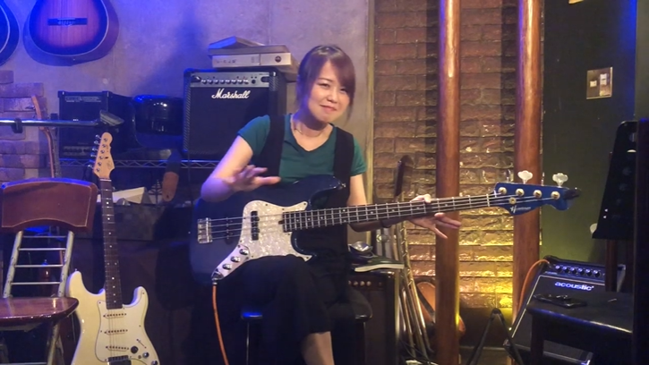

いいか？  
覚えておいてくれよな！

### グルーヴ感の出し方

それでは実際に、そのグルーヴ感というのは、どう出すのか？

グループ感というのは
- 音の長さ
- 長短
- そして強さ（強弱）  

をウマい<ruby><rb>塩梅<rb><rt>あんばい</rt></ruby>で出していくことによって生まれるんだ。

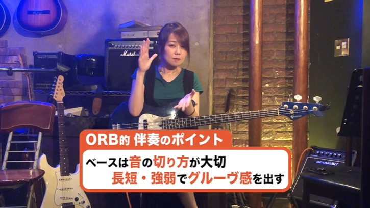

いいか？

同じ音を出していても、この長短そして強弱を変えるだけで、全く違う音に聞こえる。

早速やってみよう。  
<video src="video01.mp4" controls width="100%"></video>
どうだ？  
全く面白味がないだろう？

ではこれをどういうふうに音楽に変えていくか？  

先ほども言った通り音の長短、そして強弱をつけることによってグルーヴ感を出してみよう。

こんな感じで。  
<video src="video02.mp4" controls width="100%"></video>

どうだ？

なんとなくノリが出てきただろう？  
君にもこのグルーヴ感、届いてるかなぁ？

このようにしてグルーヴ感を出すことによってペースが活きるんだな～。

> 中には最初からいろんな音を出したいなんて人がいるんだけど、そんなものは必要ない。
>
> ちなみにそれに早速いきたいという人は、  
> ↓ コッチを見てくれ。  
> 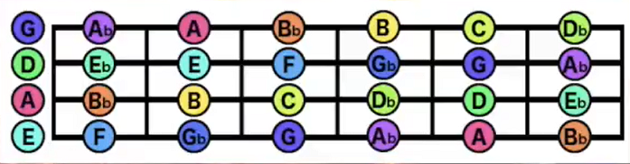

それでは早速このグルーヴ感の出し方を教えていこう。

### 左手（弦の押さえ方）

まずは左手。  

この左手で弦を押さえるんだけど、この**押さえる指がフレットと呼ばれるこの縦線から離れてしまうと汚い音になってしまう**。

こんな感じ  
<video src="video03.mp4" controls width="100%"></video>

**オーマイガー！**

こんな音じゃ誰もグルーヴ感を感じられないよ。

それではこれをどうやって解決するかというと、先ほども言ったみたいに**このフレットの近くで押さえるようにする**んだ。  
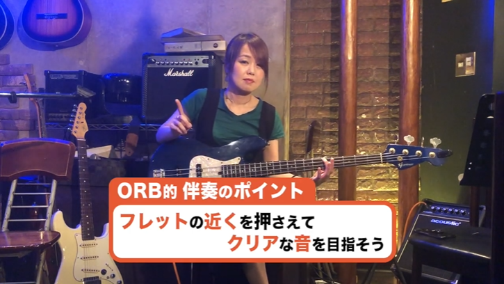

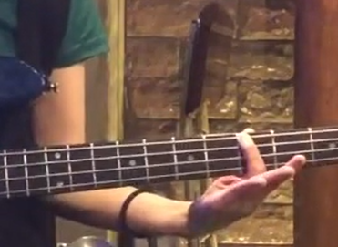

そうするとクリアな音質になる。

こんな感じで  
<video src="video04.mp4" controls width="100%"></video>

・・・ワンダフォーでクリアな音質じゃないか！

こういうクリアな音質をみんなも目指してくれ。

### 右手（弦のはじき方）

それでは続いては右手。

右手では弦をはじくんだけどもこれは指弾き、そしてピック弾きという2通りがある。

ただ基本的には指弾きで全く問題ない。

指弾きではこの人差し指そして中指を、交互にこうして弾いていくんだ。  
<video src="video05.mp4" controls width="100%"></video>

以下この動きをマスターすることによってスムーズに、そして何回も連打でベースを弾くことができる。  
これをまず練習することが大切だ。  

早速それのトレーニングにいってみよう

まずはこんな感じ
<video src="video06.mp4" controls width="100%"></video>

これ簡単に見えるけど、実は意外に難しいからぜひ練習してみてくれ。

## 音の止め方

それでは続いては、**音の止め方**について解説していこう。

止め方は、左手と右手両方のスタイルがある。

まずは右手からやっていこう。

右手では、**弾いた弦をそのまま押さえるだけで音が止まる**。  
こんな感じだ。

<video src="video07.mp4" controls width="100%"></video>

ただ実は、もう一つ音を止める方法がある。  
**それは押さえてる方の左手を離す**、というやり方なんだ。

早速やってみよう。  
<video src="video08.mp4" controls width="100%"></video>

この2つのテクニックをうまく組み合わせていくことによって、グルーヴ感を出していくんだ。

実は、ベースというのは音を出すことよりも、音を切るほうが大切な楽器なんだなぁ。  
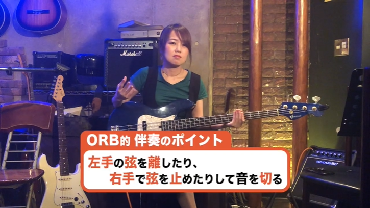

これは覚えといてくれ。

## 練習用ドリル

ん？なになに？  
「これを練習する簡単なドリルなんか、ありますか？」  
だって？？  

ハハハッ！

キミ、そのモチベーション最高だぜ！

それではさっそく教えていこう。

まずは、**16分音符の「1」のところだけで弾いていく**という練習をしよう。  
こんな感じだ。
<video src="video09.mp4" controls width="100%"></video>  
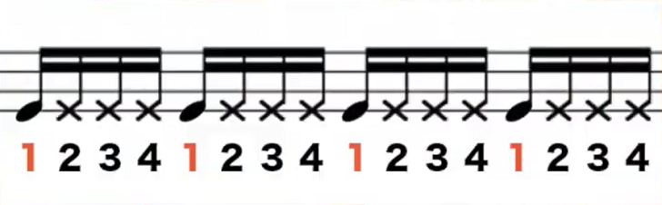  

 

このようにして、左手は

- 「1」の時はちゃんと弦を押さえて、
- 「2」「3」「4」の時は若干浮かす

という練習をして音を消す練習をしよう。

 

ただ、この「2」「3」「4」の時もちゃんと右指は弾くようにしてくれ。

こんな感じで。  
<video src="video10.mp4" controls width="100%"></video>  

こんな感じだ。

 

もしこれに慣れてきたら、次は **「2」のときだけ音を出す** という練習をしてみよう。  
<video src="video11.mp4" controls width="100%"></video>  
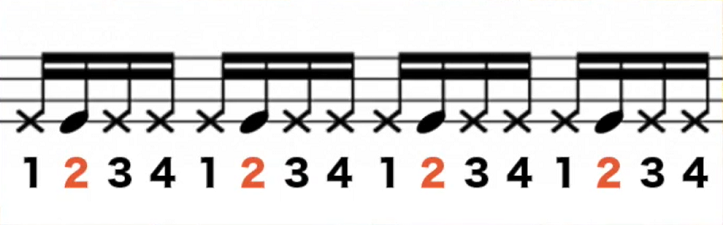  

こんな感じだ。

実はこれ、非常に地味なトレーニングなんだけど、これをやってるとやってないでは全然違うんだ。

実はベース経験者でも、こういったことを疎かにしたせいで全然ダメって人がいる。  
覚えといてくれ。

## 曲をやってみよう

それではさっそく曲をやってみよう

実はベースというのは、**あまり多くの音を出さなくてもなんとなく、「っぽくなる」というのも利点**なんだ。

今から私がやる曲は、**「C」「D」「E」**の3つだけで構成されている。
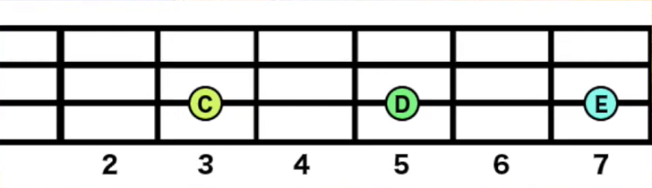  

まずは **「C」**
<video src="video12.mp4" controls width="100%"></video>  

次に **「D」**
<video src="video13.mp4" controls width="100%"></video>  

そして **「E」**
<video src="video14.mp4" controls width="100%"></video>  

この3つの音、そして先ほど紹介したグルーヴ感のテクニックを使って、曲をやってみよう。

もしかしたら知ってる人もいるかもしれない。
早速トライだ！

<video src="video15.mp4" controls width="100%"></video>  

もしかしたら30代のあなたは気づいたかもしれないね。  
この聞きなじみのあるリフ。

もしかしたらこれを聞きながら、  
ラップが出ちゃった！  
なんて人もいるかもしれないねえ。

 

以上で私のベース講座は終了。

もしもっとベースをマスターしたいって人は、番組概要欄からORB（オーブ）の住所を見て、ぜひ来てくれよな！

この動画で習ったことを実践して、君もバンドデビューだ！

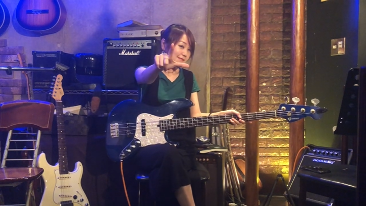

---

ナレーター：じんぼぼんじ  
  
[Twitter](https://twitter.com/jimbobonji)

---

 
住所： 東京都目黒区大橋2-1-1 ランドステージ松見坂 B1F