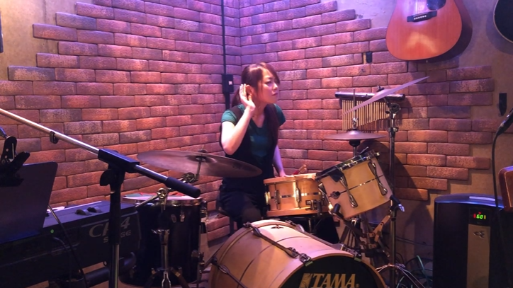
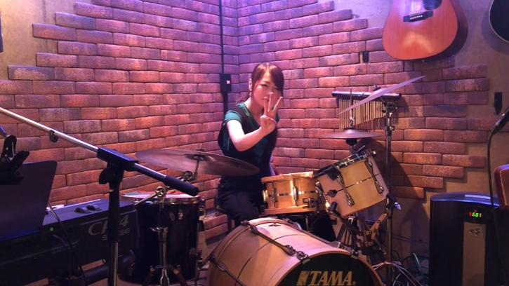
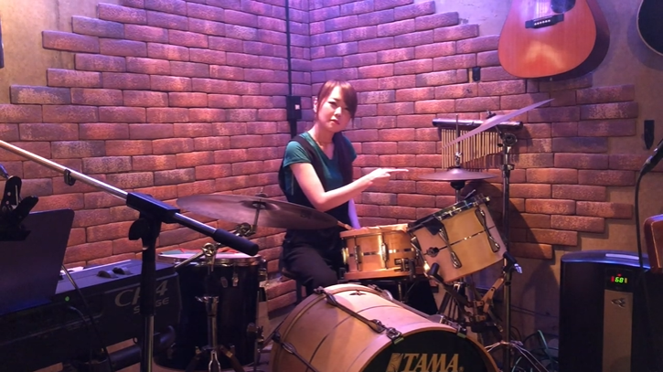
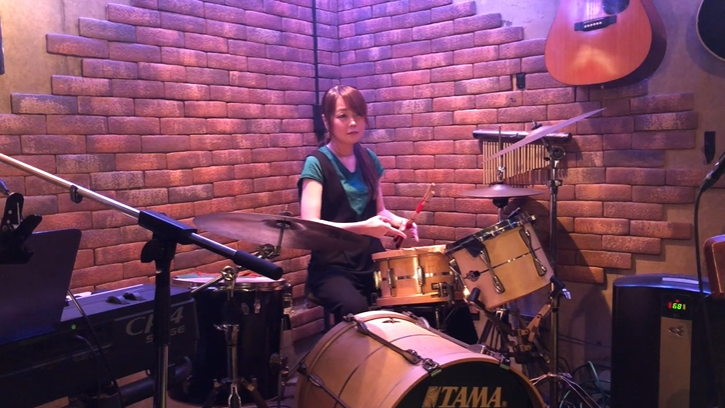
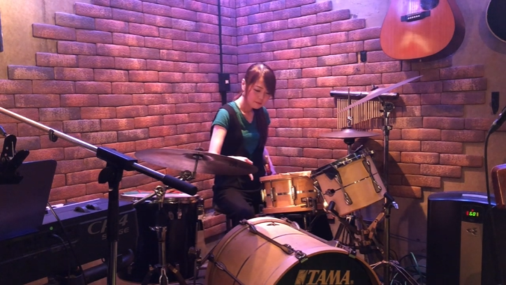
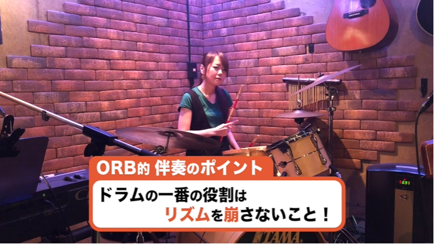
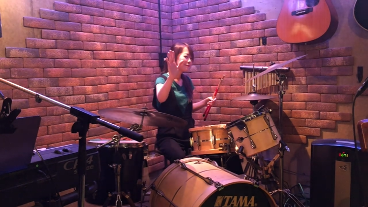



[⇒ Youtubeで見る場合はコチラ](https://www.youtube.com/watch?v=Zf02CRXGJAY)

やぁ！みんな！  
ようこそ！私のドラム講座へ！

ん？ナニナニ？  
「大人になってドラムを始めてみたい」  
だって？  

うん、その気持ち、分かる分かる。

ただ大人になってドラム始めると言っても、なかなか機材がなかったり、あと、どっから始めていいか分からないよね？

そんなアナタに朗報だ！

なんと、**たった3日**。
  

3日さえあれば、すぐに叩ける簡単なドラムの基礎をここで教えちゃうぜぃ！  
たった3日で出来ちゃうなんて、お得だと思わないかい？

それは早速始めていこう！

## 初心者は3つの箇所を叩くだけ

まず初心者がドラムを始める場合、こんだけ多くある機材の中でも、**実は必要なのはたった3つの箇所だけ**なんだ。

それは、まず、ここの「**ハイハット**」。  
  

そして私の目の前にある「**スネア**」や、  
  

最後は足元にあるこの「**バスドラキック**」と呼ばれるものだ。  
  

この3つを使うだけで、**だいたい6割の曲はできてしまう**と考えて過言ではない。

それでは早速始めていこう。

### 「ハイハット」はドラムの心臓

まずはここにあるハイハット。  
**ハイハットは、ドラムの心臓**と言っても過言ではない。

ぜひちゃんとマスターしてくれ。

まずはハイハット大自分の好きなリズムで  
<b>「1」「2」「3」「4」 </b>  
というふうに叩いてくれ。

例えばこんな感じだ。  
<video src="video01.mp4" controls width="100%"></video>

これをやるときは必ず先ほどみたいに  
<b>「1」「2」「3」「4」 </b>  
と頭の中で数えながらやることが重要だ。

これは一見簡単に見えるんだけど、実はこの**ハイハットのリズムを常に一定にする**。
  

このリズムを崩さないということが、非常に重要なんだ。  
いいか？覚えといてくれ。

### 「スネア」を入れると一気に「っぽくなる」

それでは続いてはスネア。

このスネアを先ほどのカウントの  
<b>「1」「2」「3」「4」 </b>  
の、 <b>「3」</b>   
のタイミングで叩いていこう。  

例えばこんな感じになる。  
<video src="video02.mp4" controls width="100%"></video>

こんな具合だ。

これだけだとなんだか吹奏楽の練習みたいに聞こえるけど、これを速くすることで一気に「っぽくなる」。  

早速聞いてくれ。
<video src="video03.mp4" controls width="100%"></video>

どうだ！
一気にドラムっぽくなっただろう？

これを聞いてるだけで、  
「なんだかリズムが湧いてきちゃった。」  
みたいな人もいるんじゃないかな？

### 「キック」を入れると本格的なドラムサウンドに！

そして最後に、このキック。  
このキックを入れるだけで一気に本格的なドラムサウンドになる。

このキックを先ほどの  
<b>「1」「2」「3」「4」 </b>  
の、 <b>「1」</b>   
のリズムの時に踏んでみてくれ。
そうするとこんなサウンドになる

<video src="video04.mp4" controls width="100%"></video>

オー！イエス！  
どうだどうだ！  
このリズム最高だろ？

「ここはもはやレッスンスタジオではない。  
　ここは武道館だ。  
　そして私はプロのドラマーだー！」

なんて気分になった人もいるんじゃないかな？

ハッハッハッハー！

## キックの苦手克服法

ここで一つ注意点。

って実は、この足を入れるだけで  
「一気に難しくなっちゃった」  
なんて人がいるんだけど、そんな心配はない。

実はこの解決法が1個だけある。

### キックとスネアだけで練習

先ほどのこのハイハットを抜いて、  
**キック**と、**スネア**。  
**キック**、**スネア**。  
「**ド**」、「**パ**」。  
で、ずっとやるっていうトレーニングをしてみてくれ。

いいか？
ただその時に注意点としては、頭の中で  
<b>「1」「2」「3」「4」 </b>  
のリズムもずっと意識してくれよな。

例えばこんな感じになるんだ。  
<video src="video05.mp4" controls width="100%"></video>

### 慣れてきたらハイハットも入れる

そしてこれに慣れてきたら、**次はハイハットを入れてみよう**。

こんな感じだ

<video src="video06.mp4" controls width="100%"></video>

こんな感じでやっていけば、すぐに叩けるようになる。

## あとはこれを応用するだけ！

ん？ナニナニ？  
「本当にこれでドラムの6割叩けるんですか？」  
だって？

ハハハハ！  

もっともな意見だな。  
ただこれを応用していくだけで、本当にいろんなドラムが叩けるんだ。

こんな感じだ。  
<video src="video07.mp4" controls width="100%"></video>

こんな感じだ。  
これぐらいのレベルだったら大体一週間も真剣にやればすぐに到達できる。

どうだい？私カッコイイだろ？  
そしてドラムやってみたくなっただろう。

実はORB（オーブ）では、これぐらいだったら5分でマスターしちゃう生徒もいるんだ。  
どうだあなたも試してみないか？

## ドラムが無くても自宅でトレーニングできる

ん？ナニナニ？  
「自宅にドラムセットがないから練習できない」  
だって？

**なんてことだ！**  
**そんな悲劇があるのか？！**

そんな方のために自宅でもできるトレーニングを紹介しよう。

<video src="video08.mp4" controls width="100%"></video>

どうだい。こんな手軽に自宅でも練習ができちゃうんだぜ。

これを毎日やればあなたはもうドラマーだ！

 

今回のドラム講座はここで終了。

「もし他の楽器にも興味がある」  
なんて人がいたらぜひ他の動画も見てみてくれ。

そしてもし
「みんなで曲をやりたい」  
なんて人がいたら**ぜひORB（オーブ）に来てみてくれ**。

その時まで Hasta La Vista！  
  

---

ナレーター：じんぼぼんじ  
  
[Twitter](https://twitter.com/jimbobonji)

---

 
住所： 東京都目黒区大橋2-1-1 ランドステージ松見坂 B1F