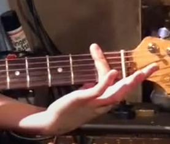
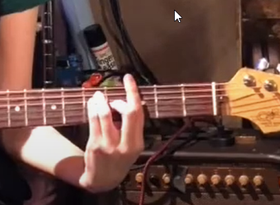



[⇒ Youtubeで見る場合はコチラ](https://www.youtube.com/watch?v=9GxDmaJ8_Bs)

やぁ、みんなぁ！  
ようこそ！  
私のギター講座へ！

ん？なになに？  
「昔ギターをやったことがあるけど、もう一回チャレンジしてみたい！」

ん？なになに？  
「まったくギターをやったことがないけど、大人からでもできますか？」  
だって？

ハハハッ！

そんなあなたに、ぴったりの講座だ！

この講座ではギターの基本中の基本を、分かりやすく解説していく。

決して  
「プロになりたい！」  
みたいな人向けではないからね。  
ここは注意してくれ。

あくまで、**曲の伴奏するために必要なスキルを最速で習得しちゃおう！**  っていう講座だ。

ただ、これをやり始めて、ギターにハマっちゃって、**そのまま路上ライブ**なんか出てみたりなんかして、そこにたまたま通りかかった人がレコード会社の人で、まさか**君がメジャーデビュー！** 

・・・なーんてことはないかもしれないけども、そんな勢いを持ってぜひトライしてみてくれ！

## ギターとはどんな楽器？

まずはギターという楽器について説明してみよう。

ギターにはご覧のように**6つの弦**がある。

これはどういうことかというと、いろんな音を同時に奏でる、つまり『**和音（コード）**』を出すということなんだね。

コードについての詳しい情報は概要欄を見てくれ。

 

ここではざっくりと**コードというのは曲全体の雰囲気を作る**という風に考えてもらっていいんだけど、ギターで出来るのは、それだけじゃないんだ。

ギターというのは**曲の雰囲気を作りつつ、ちょいちょいとエッセンス**を入れられる。  
つまり**ちょっと目立ちたがり屋の楽器**なんだ。

そこの目立ちたがり屋のキミ！  
ワクワクしてこないか？

さて、早速ギターを始めていこう。

とその前に。

## Fコードさえクリアすれば、ギターは難しくない！

この動画を見ているということは、もしかしたらギターに興味があって、ギターの初心者用の本なんかを買って、コードの押さえ方を若干知ってる、なんて人もいるんじゃないかな？

例えばこんな風に。

<video src="video01.mp4" controls width="100%"></video>

こんな感じの押さえ方は見たことないかい？

（『**C**』コード）  

（『**D**』コード）  

これを我々の中では『**ローコード**』という風に呼んでいる。

ただ、これをマスターしただけでギターができるようになるんだったら、そんなに苦労はしない。

ただみんな、こんなのを聞いたことないかい？

「**F** コードが押さえられなくて諦めちゃった。」  
「**B** がどうしても弾けなくて、もうやめちゃったんだよ。」

なんて話、よく聞いたことがあるよねー。

実を言うと私もその一人なんだ。  
昔ギターに挑戦してみたんだけど『Fコード』でつまずいて諦めてしまった。

ただ実は、考え方を変えるだけでこれは解決できるんだ。  

実は **『Fコード』が弾けるようになるとギターの大半のコードはできるようになる**んだ。

これを知っていたかい？

つまり、  
「Fコードでつまずいたから、もうギター諦めたよ。」  

じゃなくて、実は、  
「Fコードさえできれば、ギターはそんなに難しい楽器じゃない。」  

ということなんだ。

そこで、**ORB（オーブ）では、ギターをFコードから教えるようにしています。**

### ギターの制覇は『セーハ』から

そして、Fコードの最も難しい事って、なぁ～んだ。

うん！   
そうだ！

つまり、人差し指一本で6つの弦全てを押さえきる。

これを『**セーハ**』と呼ぶんだけど、これが難しいんだよねー。

これを初心者がやると、  
指が痛くなって、  
握力も無くなって、  
肘も痛くなって、  
肩も痛くなって、  

「もう仕事にもならない」

なんてことが起きるんだ。

ただ先ほども言ったみたいに、この**Fコードのセーハ**さえ出来るようになれば、ギターはほぼほぼもらったと言っても過言ではない。

いいか？  
よく覚えといてくれ！  

<big>**ギターの制覇はセーハから**！</big>

よく覚えおいてくれよな。

### Fコードのセーハのやり方

それでは早速、Fコードのセーハのやり方について説明していこう。

まずは**セーハというのは、人差し指で一つのフレットすべてをカバーする押さえ方**だ。

例えばこんな音が鳴る

<video src="video02.mp4" controls width="100%"></video>

このセーハには、大きく分けて2つのポイントがある。

まず1つ目。

『**押さえる方の人差しの腹ではなく、側面で押さえる**』ということだ。  

いいか？  
**腹**ではなく**側面**だぞ。

そしてもう一つのポイント。

それは、  
『**フレットの近くで押す**』  
ということだ。

こうすることによってきれいな音が出やすい。

イメージとしては、フレットに指を押し付ける感じだ。  
こんな感じで。  

これがうまくできているかどうかは、一つ一つの弦を自分で弾いてみると、分かりやすい。

<video src="video03.mp4" controls width="100%"></video>

もしこの中で1本でも音が鳴っていなかったり、  
「ちょっとビリビリするなぁ」  
なんてのがあったらそこを意識的に押すようにしてみてくれ。

そしてこれができるようになったら、ついにFコードに挑戦だ。

Fコードの仕方はこんな感じ。

<video src="video04.mp4" controls width="100%"></video>

（『**F**』コード）  

どうだ、この響き！  
完全にFコードじゃないか！

あんなに苦労していたのが嘘みたいだ。  
10年前の自分に伝えてやりたい。

「**Fコードなんて簡単に弾ける**」

ってね！

### Fコードが弾ければ、他のコードも弾ける！

このFコードさえマスターしてしまえば、もうもらったも同然だ。

例えば先ほどは**Fメジャーコード**だったんだけどもこれを中指をなくすだけで、**Fマイナーコード**になる。

<video src="video05.mp4" controls width="100%"></video>

（『**Fm**（Fマイナー）』コード）  

また**Fコード以外を出したい場合は、同じ形のままフレットをズラす**だけで済むんだ。

ここでは
「**F**」「**G**」「**A**」「**B**」  
の順番に鳴らしていこう。

<video src="video06.mp4" controls width="100%"></video>

(『**F**』コード)  

(『**G**』コード)  

(『**A**』コード)  

(『**B**』コード)  

どうだ！

Fメジャーコードの押さえ方をマスターするだけで、一気に4つのコードが押さえられるようになっただろう？

音楽の教則本に出てくるような複雑な押さえ方なんて必要ないからね。

この要領で「**F**」と「**B**」をマスターするだけで、たいていのコードは弾けるようになる。

## ギターで曲を伴奏してみよう

それではここからいよいよ実践。

実は私、**ギターを始めてまだ1ヶ月**なんだけど、その1ヶ月でマスターした曲を聴いてくれ。

<video src="video07.mp4" controls width="100%"></video>

・・・それでは、私の1ヶ月の成果を見てくれ。

（Take 3）  
<video src="video08.mp4" controls width="100%"></video>

・・・まあまあ今回はこれぐらいで勘弁してやる。

私が1か月であまりに出来ちゃうと、視聴者のみんながビビっちゃうかもしれないからねぇ。

 

今回のギター講座は以上だ。

もし

「もっとギター上達したい」、  
だったり、

「早速ギターをトライしてみたい」  
なんて人がいたらぜひ**ORB（オーブ）に来店してみてくれ**。

それでは、君の挑戦待ってるぜ！

 

---

**＜編集後記＞**

初心者にセーハからギターを始めさせるなんて、なんてスパルタなんだろう・・・  
と思ってORB（オーブ）マスターの忍者さんに聞いてみたら、  
「実際そうやって覚えたヤツいるんだよ」  
ですって。

そして、ナレーターのじんぼさんも、そうやってギターを覚えたそうな。

どうせ後になってFでつまずくなら、やる気の一番ある最初にその壁を乗り越えた方がいいんじゃないか？  
みたいな話もしていて、確かに一理ありますね。

そう考えると、初心者さんは、CとかDとかのローコードも覚えつつ並行して、FとかGのセーハも練習するのは、実は合理的かもしれませんね。

 

（ブログ書いた人：ダイ）  
  

 

---

ナレーター：じんぼぼんじ  
  
[Twitter](https://twitter.com/jimbobonji)

---

 
住所： 東京都目黒区大橋2-1-1 ランドステージ松見坂 B1F