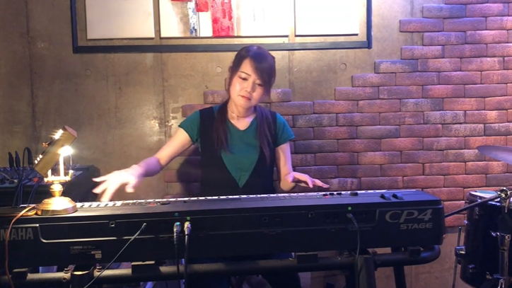



[⇒ Youtubeで見る場合はコチラ](https://www.youtube.com/watch?v=dxAVyHOi2-0)

やぁみんな！私のピアノ＆キーボード講座へようこそ！  
ここではみんなが知ってるピアノという楽器について解説していくぜ！  

ん？ナニナニ？  
「昔ピアノをやっていたから、またバンドでやってみたい」  

ん？ナニナニ？  
「一回もやったことがないけど今から始めたい」  
だって？  

そんなチャレンジ精神、ナイスだと思うぜ！  

それでは、早速ピアノの解説から始めよう、

・・・とその前に。

## バンドの中でのピアノの役割

ピアノというのはバンドにおいてどんな役割があるか？

それは、『**曲全体の雰囲気をかもし出す**』ということなんだねー。  

では、その雰囲気というのは一体どうやって作っているか？  

### ピアノの伴奏はコードで成り立っている

皆さんご存知の通り音楽ってのは色んな音で成り立っているんだけど、ピアノというのはそれを複数合わせた和音、つまり**コードで成り立っている**。  

例えばこれが『Cメジャーコード』。  
 <audio controls src="sound01.mp3">Your browser does not support the <code>audio</code> element.</audio>

この『Cメジャーコード』は、 C、E、G という三つの音で構成されている。  
 <audio controls src="sound02.mp3">Your browser does not support the <code>audio</code> element.</audio>

そしてこの三つを同時に押すと・・・  
 <audio controls src="sound01.mp3">Your browser does not support the <code>audio</code> element.</audio>  

どうだ。別々の音を同時に押すだけでこんな雰囲気になっちゃうんだぜ！  
ピアノというのは基本的にこういうふうに弾いていく。  

もしコードの詳しい作り方を知りたければコチラへ。

## ORB（オーブ）流のピアノ講座

それではさっそく**ORB（オーブ）流のピアノ講座**の開始だ。  
ORB（オーブ）では、基本的にピアノの弾き方を両手に分けて教えている。  

### 左手

まずは左手。  
左手ではベースと呼ばれる低音を押していく。

そして、押す音は、コードのルートと呼ばれる音だ。

例えば『Cメージャー』であれば、『C』。  
これを親指と小指で両方で押していく。

こんな感じだ。  
 <audio controls src="sound03.mp3">Your browser does not support the <code>audio</code> element.</audio>  

### 右手

そして続いては、右手だ。  
右手は先程のように和音を奏でる。  

この2つを同時にあわせると・・・  
<audio controls src="sound04.mp3">Your browser does not support the <code>audio</code> element.</audio>  

基礎はこんな感じだ。  

いいか？  
ここまで付いて来れてるかな？  

## 曲を弾いてみよう

それではさっそくだけど、曲にいってみよう！  

先ほども言ったようにコードの仕方については、  
各自ネットで調べるかもしくは、  
**ORB（オーブ）に来てくれれば懇切丁寧に教えてやるぜ**！

それでは早速、この定番曲にいってみよう。  
ただ、最初はコードだけだから、もしかしたら分からないかもしれないね。  

聞いてみてくれ。  
<audio controls src="sound05.mp3">Your browser does not support the <code>audio</code> element.</audio>  

このようにいろんなコードを奏でていくのがピアノという楽器なんだ。  

ただ今のを聴いてると、  
「なんとなく幼稚園のお遊戯会みたいだねー」  
なんて声が聞こえてきそうだねー。  

・・・もっともな意見だ。

これを解決する策がある。つまりピアノを『**らしく**』聴かせるコツなんだ。  
それは何かというと、**リズムをつけていくこと**なんだ。  

いいか？リズムをつけることによって、ノリや雰囲気がもっと出る。

早速やってみよう！  
<audio controls src="sound06.mp3">Your browser does not support the <code>audio</code> element.</audio>  

どうだ。押してるのは全く同じコードなのに、全然違う曲に聴こえただろう？
一気に『らしく』なっただろう？  

基本的には、こういう風にしてピアノというのは弾いていく。  

## 気を付けなくてはいけないポイント

ただ、もしかしたら気づいた方もいるかもしれない。  
ここで一つポイントがあるんだ。  

先ほどのように、左手は（この場所の）まんま。  
ただ**ここで大事なのは、右手**。

実は、ピアノ経験者の中には右手をいろんなところに置いちゃう、っていう人がいるかもしれない。  

もちろんクラシックではこれが正しいんだけど、ORB（オーブ）流のピアノはチョット違う。

ORB（オーブ）流のピアノはあくまでも伴奏を目的としているから、できる**限り限られた範囲で音を作る**ようにお勧めしている。  

例えば『Cメジャー』でも・・・  
<audio controls src="sound07.mp3">Your browser does not support the <code>audio</code> element.</audio>  

  

これとあと、『オクターブ上の Cメジャー』というのがあるんだ。  
<audio controls src="sound08.mp3">Your browser does not support the <code>audio</code> element.</audio>  

ただ曲中に急にこんな高い音が出たら歌の邪魔だよねー。  
だからオーブではあえて狭い範囲で弾くようにしてるんだ。

こんな感じ。  
<audio controls src="sound09.mp3">Your browser does not support the <code>audio</code> element.</audio>  

観ていただいたように、私の右手はほとんど動いていなかったでしょ。  
この狭い範囲でやるのがオーブ流なんだ。

これをマスターできれば、あなたもいつでもORB（オーブ）で伴奏ができる。 

### ピアノは演奏全体のバランスが大事

そして最後にみんなに伝えておきたいことがあるんだ。  
ピアノというのは一見難しそうに見えるけど、こうした基礎さえ押さえておけばさほど難しい楽器ではない。  

ただ、ここで最も重要なことを一つだけ覚えておいてほしい。  

**ピアノというのは全体の雰囲気をまとめるような役割を持っている**。  

つまり何かというと、全体のバランスを考えてほしいんだ。

いいか。ピアノが一人でこうやって、ガチャガチャガチャガチャってしまったら、**曲が台無しになっちまう。ナンセンスなんだよ！**   

あくまでボーカルが聞こえる程度。そして全員の音がほどよく聞こえる程度というバランスを意識してくれ。  
これはすべてのが楽器に共通する。

どうだ、みんな。
バンドやりたくないかな？

 

今回の講座は、以上だ。

もし他の楽器にも興味があるって方はぜひ他のも見てくれ！  
あと先ほど言ったけど、コードの作り方は番組の概要欄に書いてあるから、是非チェックしてよな。  

これで君もピアノをマスターできるぜ！  

---

ナレーター：じんぼぼんじ  
  
[Twitter](https://twitter.com/jimbobonji)

---

 
住所： 東京都目黒区大橋2-1-1 ランドステージ松見坂 B1F